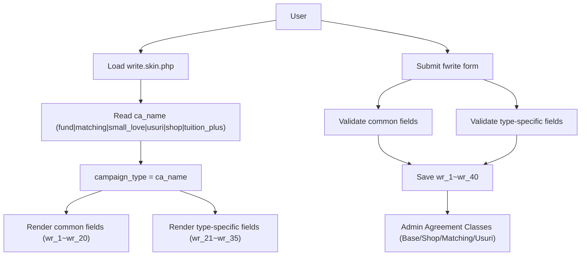

## 스폰서 작성 폼 6가지 양식 구조 개편 계획

### 1. 현재 구조 분석 요약

- **기존 상태**
  - `skin/board/sponsor/write.skin.php`는 단일 "발전기금" 형태의 기부신청 폼으로 구현되어 있음.
  - 상단 `기부정보`(금액, 납입기간, 납입방법 등)와 하단 `기부자 정보`(인적사항, 연락처, 주소, 권유자, 약정일 등)로 구성되어 있고, CSS 클래스 구조(`.donate-form-container`, `.donate-info-section`, `.donor-info-section` 등)는 안정적으로 구성되어 있음.
  - `wr_` 필드 사용이 설계 문서(`write_sponsor_php.md`)의 표준 매핑과 충돌하는 부분이 다수 존재 (예: `wr_10`이 기금용도 기타와 기부자 유형에 동시에 사용, `wr_1`이 금액 전용 등).
- **요구사항 요약**
  - HTML/CSS 레이아웃과 스타일은 **최대한 유지**.
  - 카테고리(`ca_name`) 값에 따라 **6가지 양식**으로 분기.
  - 공통 양식(기부자 인적사항, 권유자, 메모, 약정일 등)을 하나로 통일하고, 각 캠페인별 특화 필드만 분기.
  - 가능한 범위에서 `wr_1 ~ wr_40` 매핑을 설계 문서 기준으로 **정렬 및 통일**.

### 2. 카테고리 기반 6가지 캠페인 타입 정의

- **실제 ca_name 값** (별도 매핑 없이 그대로 캠페인 타입으로 사용):
  - `fund` | `matching` | `small_love` | `usuri` | `shop` | `tuition_plus`
- **선택 로직**
  - 작성/수정 화면 진입 시:
    - `$write['ca_name']`가 있으면 그 값을 그대로 `$campaign_type`으로 사용.
    - 없을 경우, 카테고리 라디오 기본 선택값을 `fund`로 두고 `$campaign_type = 'fund'` 사용.
  - 유효한 타입 목록: `['fund','matching','small_love','usuri','shop','tuition_plus']`로 화이트리스트 검사.
  - 이 타입 값을 기반으로 **특화 입력 섹션 블록을 조건부로 렌더링**.

### 3. 공통 양식 wr_ 필드 재매핑 설계

- **목표**: 모든 6가지 양식에서 공유하는 공통 데이터는 동일 wr_ 인덱스를 사용하도록 조정.
- **공통 그룹 (예시, 설계 문서 기준)**
  - **권유자 정보 (Solicitor)**
    - `wr_1`: 권유자 소속
    - `wr_2`: 권유자 직무
    - `wr_3`: 권유자 성명
    - `wr_4`: 기부자와의 관계
  - **기금 기본 정보**
    - `wr_5`: 기부금액/수량(또는 금액 단위) – 상단 금액 영역에서 이 값으로 통일
    - `wr_6`: 기부 용도/기금 유형 (e.g. 발전/연구/장학/시설/기타)
    - `wr_7`: 지원기관/지정 기관명
  - **납입/결제 정보**
    - `wr_8`: 납입기간/출연기간(요약)
    - `wr_9`: 납입방법 (무통장/자동이체/방문/급여공제 등 코드값)
    - `wr_10`: 기타 결제 관련 메모 또는 세부 구분값
  - **계좌/결제 상세 (`wr_11 ~ wr_15`)**
    - 예: 은행명, 계좌번호, 예금주, 결제일, 기탁계좌 등 (기존 상단 납입방법 세부 필드와 매핑).
  - **관계/학적 및 메타 (`wr_16 ~ wr_20`)**
    - 대학과의 관계, 학과, 학번, 졸업년도, 기타 메타 정보를 배치.
- **기부자 인적사항, 주소, 연락처 등**
  - `wr_name`, `wr_email` 등 기본 그누보드 필드는 그대로 사용.
  - 현재 하단 섹션에서 사용 중인 `wr_5`, `wr_6`, `wr_7`, `wr_8`, `wr_9`, `wr_10`, `wr_11~wr_16` 등은 **위 공통 설계에 맞게 이름/역할을 변경**하고, UI 텍스트만 유지.

### 4. HTML 구조 유지하면서 name 매핑/섹션만 조정

- **레이아웃/스타일 유지 원칙**
  - `.donate-form-container`, `.donate-info-section`, `.donor-info-section` 등 상위 컨테이너와 그 안의 박스 구조는 변경하지 않음.
  - 레이블 텍스트, placeholder, 버튼, 구분선(`.section-divider`) 등은 현재 디자인 그대로 유지.
- **필드 name 재정렬**
  - 상단 `기부정보` 영역:
    - 금액 라디오 + 직접입력 → 최종 값은 `wr_5`로 저장되도록 JS/hidden input 구조 변경.
    - 납입기간(일시/분할) 관련 wr 필드 → 공통 설계에 따라 `wr_8`, `wr_11~wr_13` 등으로 재매핑.
    - 납입방법(무통장, 자동이체, 방문, 급여공제) 세부 필드 → `wr_9`, `wr_11~wr_15` 범위에 배치.
    - 지원기관/기금용도 라디오와 텍스트 → `wr_6`, `wr_7`, `wr_10` 등에 배정.
  - 하단 `기부자 정보` 영역:
    - 기부자 유형, 성함, 주민/사업자번호, 전화번호, 관계, 주소, 기타 전달사항, 권유자 정보, 약정일, 기부(약정)자 성명 등은 설계 문서의 공통 매핑에 따라 `wr_1~4`, `wr_16~20` 등에 다시 연결.
- **JS 로직 정리**
  - 금액 처리(JS `fwrite_submit`)에서 현재 `wr_1`로 저장하는 로직을 `wr_5` 등 새 필드로 수정.
  - 전화번호 조합(`wr_15`) 및 사업자번호 포맷팅, 주소 검색, 납입기간/방법 토글 등 기존 스크립트는 동작은 유지하되, 참조하는 요소의 `name`/`id`가 바뀌는 부분만 동기화.

### 5. 6가지 개별 양식 섹션 분기 설계

- **공통 구조**
  - 상단 `기부정보` 블록 내에, `campaign_type`에 따라 추가 필드/설명을 보여주는 **하위 섹션**을 둠.
  - HTML 예: `div.campaign-extra-section.campaign-extra-fund`, `campaign-extra-matching`, ... 형태로 나누고, PHP 및 JS로 표시/숨김 처리.
- **각 타입별 필드 구성 (wr_21~wr_32 중심)**
  - **fund (발전기금)**
    - 현재 기본 폼 구조 대부분이 fund 타입에 해당.
    - 추가 섹션 없이 공통 필드+기존 상단 로직으로 커버.
  - **matching (1:1 매칭 장학)**
    - 추가 필드: 신청구좌(`wr_31`), 출연기간(`wr_32`).
    - UI: 간단한 선택/입력 필드 2개를 상단에 작은 블록으로 추가.
  - **small_love (작은사랑)**
    - 매월 정기 출연에 특화.
    - 금액 부분을 "월 정기금" 설명으로 텍스트만 조정하고, 자동이체 선택 시 계좌/결제일 필수 처리.
    - 필요 시 `wr_31`에 작은사랑 전용 메모/옵션 필드 1개 정도 배정.
  - **usuri (우수리 기금)**
    - 필드: 기부기간(`wr_31`), 개인정보/제3자 제공 동의(`wr_32` – 체크박스/라디오).
    - UI: 간단한 설명 텍스트 + 기간 입력 + 동의 체크 영역.
  - **shop (후원의 집)**
    - 필드: 업종(`wr_31`), 업체명(`wr_32`), 대표자(`wr_33`), 업체소개(`wr_34`), 지정일(`wr_35`).
    - UI: 현재 하단 인적사항과 겹치지 않도록, 상단이나 중간에 "후원의 집 정보" 박스로 묶어서 추가.
  - **tuition_plus (등록금 한번더)**
    - 금액 선택: 라디오/셀렉트로 정해진 금액(예: 1만, 2만, 3만 등)만 제공하고, 직접입력은 비활성.
    - 선택된 값은 마찬가지로 `wr_5`에 저장.
- **표시/숨김 처리**
  - 서버 사이드: `$campaign_type`에 따라 각 블록의 `hidden` 클래스 부여/제거하여 초기 상태 결정.
  - 클라이언트 사이드: 카테고리 라디오(`ca_name`) 변경 시 JS로 `campaign_type`을 재계산하여 해당 extra 섹션만 보이도록 토글.

### 6. 유효성 검사 및 제출 로직 정리

- **공통 검증**
  - 기부금액/수량(`wr_5`) 필수.
  - 기부자 성함, 주민/사업자/법인번호, 주민번호 필수 여부는 현재 규칙 유지(또는 설계 문서 기준으로 보완).
  - 카테고리 선택(기부유형) 필수.
- **타입별 추가 검증**
  - matching: 신청구좌, 출연기간 둘 다 필수.
  - usuri: 기부기간 필수, 개인정보/제3자 제공 동의 여부 필수 체크.
  - shop: 업종, 업체명, 대표자, 지정일 필수, 업체소개는 선택.
  - tuition_plus: 금액 선택 필수, 직접입력 비활성.
- **JS 구현 위치**
  - 기존 `fwrite_submit` 내부에 `switch (campaign_type)` 또는 if 블록으로 타입별 검증 로직 추가.
  - 타입 계산은 PHP에서 hidden input(`campaign_type`)으로 내려주고 JS에서 해당 값을 사용.

### 7. 기존 데이터 및 관리자 페이지와의 연동 고려

- **기존 게시글 호환**
  - 이미 저장된 게시글이 있다면, 현재 wr_ 필드에 저장된 값이 새 매핑과 다를 수 있음.
  - 최소한, 수정 모드(`$w == 'u'`)에서는 `$write` 배열에서 읽은 값이 새 필드 구조에 맞게 각 input의 `value`에 들어가도록 조정.
- **관리자 약정서 클래스와의 정합성**
  - `write_sponsor_php.md`에서 정의한 `BaseAgreement`, `ShopAgreement`, `MatchingAgreement`, `UsuriAgreement` 등에서 참조하는 wr 필드와 일치하도록 최종 매핑을 한번 더 맞춤.
  - 필요 시, 해당 PHP 클래스 구현부에서 실제 사용하는 인덱스에 맞춰 프론트 스킨의 `name`을 최종 조정.

### 8. 간단한 흐름 다이어그램

